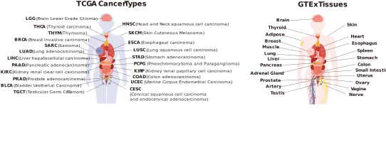
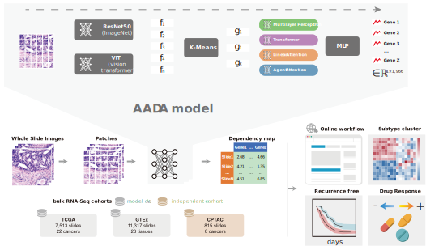

# 1. Training
This document outlines the required data files and directory structure for running the gene expression prediction training script. Ensure the following files and directories are properly prepared before execution.

(Assume your workspace is in /yourworkspace)

## 1. Reference CSV File
**`/yourworkspace/data/reference/dependency/{cancer_type}_ref.csv`**  
*(Replace {cancer_type} with your target cancer type, e.g., BLCA_ref.csv)*

**Format:**  
- *First Column: patient_id (unique patient identifier)*  
- *Subsequent Columns: Gene expression values (one column per gene)*  
- *Headers: Gene names*  

**Example:**  
```
patient_id,GeneA,GeneB,...
patient_1,0.84,1.2,...
patient_2,0.91,0.75,...
...
```

## 2. Feature Files
**Directory:**  
`/yourworkspace/data/result/cluster/{extraction_model}/{cancer_type}/`  
*(Substitute {extraction_model} (e.g., vit, resnet) and {cancer_type})*

**Requirements:**  
- *Per-Patient Files:* One file per patient (named `{patient_id}.h5`)  
- *Contents:* Each `.h5` file must contain a feature array of shape `[num_clusters, feature_dim]`  
  - `num_clusters`: Number of superpixel clusters (e.g., 900)  
  - `feature_dim`: Dimensionality of extracted features (e.g., 1024 for ViT)  
- *Consistency:* All files must use identical `feature_dim` and storage format  

## 3. Directory Structure
Organize directories as follows under `/yourworkspace`:

```
data/
├── reference/
│   └── dependency/               # Reference CSVs
│       ├── BLCA_ref.csv
│       └── ...
└── result/
    └── cluster/                  # Extracted features
        ├── vit/                  # e.g., ViT features
        │   └── BLCA/             # Cancer type
        │       ├── patient_1.h5
        │       └── ...
        └── resnet/               # e.g., ResNet features
            └── BLCA/
                └── ...
logs/                             # Auto-generated during runtime
script/                           # Source code modules (provided)
```

# 2. Evaluating
This script analyzes predictive performance of gene expression models using multi-fold cross-validation results. It computes correlation metrics, statistical significance, and error measurements to evaluate model performance against random baselines.

## 1. Input Data Requirements
**Core Input File:**  
`test_results.pkl` (Generated from Training step)  

**Located at:**  
`/yourworkspace/data/result/model/<extraction_model>/<prediction_type>/<cancer_type>/test_results.pkl`

## 2. Directory Structure Requirements
```
/yourworkspace/
├── data/
│   └── result/
│       └── model/
│           └── <extraction_model>/  # e.g., 'vit' or 'resnet'
│               └── <prediction_type>/  # e.g., 'tformer_lin'
│                   └── <cancer_type>/  # e.g., 'BLCA'
│                       ├── test_results.pkl  # Input file
│                       └── result/  # Auto-created output directory
```

## 3. Output Files
**Generated in:**  
`/yourworkspace/data/result/model/<extraction_model>/<prediction_type>/<cancer_type>/result/`

| File Type              | File Names                     |
|------------------------|--------------------------------|
| Matrices               | real_expression_matrix.csv     |
|                        | pred_expression_matrix.csv     |
| Analysis Results       | all_genes.csv                  |
|                        | sig_genes.csv                  |

**CSV Columns (all_genes.csv):**  

| Column             | Description                                  |
|--------------------|----------------------------------------------|
| pred_real_r        | Pearson r (predictions vs ground truth)      |
| random_real_r      | Pearson r (random vs ground truth)           |
| pearson_p          | P-value for prediction correlation           |
| Steiger_p          | P-value for prediction vs. random comparison |
| rmse_pred          | RMSE of predictions                          |
| rmse_random        | RMSE of random baseline                      |
| rmse_quantile_norm | IQR-normalized RMSE                          |
| rmse_mean_norm     | Mean-normalized RMSE                         |
| fdr_pearson_p      | FDR-corrected Pearson p-value                |
| fdr_Steiger_p      | FDR-corrected Steiger p-value                |
| cancer             | Cancer type identifier                       |

# 3. Predicting
This script processes whole-slide images (WSI) in SVS format to predict gene expression patterns. The pipeline involves:

1. Tissue segmentation and patch extraction  
2. Color normalization using Macenko's method  
3. Feature extraction with a Vision Transformer (ViT)  
4. Feature clustering  
5. Gene expression prediction using an ensemble of AgentAttention models  

**All predicting processes are implemented in a single Python script:**  
```python
from svsToExpr import process_svs_to_expression
result = process_svs_to_expression("./", "test.svs", "BRCA")
```

*The order of output genes are defined in `Website/R/outputgenes.txt`*

---

# 4. GeneEssentialityCalculation

## run_expression_alignment_CPTACDEPMAP.R
This script performs transcriptional profile alignment between CPTAC tumor samples and DepMap cell lines using methods adapted from Celligner. Key steps include quantile normalization, initial clustering, differential gene analysis, contrastive PCA (cPCA), and Mutual Nearest Neighbors (MNN) correction. The output is an integrated gene expression matrix for downstream analysis.


### Input Files
- Tumor data: `./data/pancan_merged_CPTAC_RNAseq_Tumor.tsv`  
- Cell line data: `./data/CCLE_expression_full.csv` (DepMap)  
- Gene annotation: `./hgnc_complete_set_7.24.2018.txt`  

> **Note:** For Seurat ≥v5, uncomment line 121 in `src/Celligner_methods.R`

### Workflow
1. **Data Loading & Preprocessing**  
   - Load tumor (CPTAC) and cell line (DepMap) expression matrices and metadata  
   - Merge datasets and apply quantile normalization (`normalize.quantiles`)  

2. **Initial Clustering**  
   - Create Seurat objects for tumor/cell line data  
   - Cluster samples using PCA and graph-based clustering (`FindNeighbors`, `FindClusters`)  

3. **Differential Gene Analysis**  
   - Identify cluster-specific genes via differential expression testing (`FindAllMarkers`)  
   - Select top differentially expressed genes (rank-based filtering)  

4. **Dataset Alignment**  
   - Apply cPCA to remove global technical biases between datasets  
   - Use MNN correction (`run_MNN`) to align tumor and cell line subspaces  

5. **Output**  
   Save aligned expression matrix as `./data/aligned_expression_DEPMAP.rds`  

### Usage
1. Configure paths in `datapath = "./"` to match your directory structure  
2. Ensure input files exist in `./data/`  
3. Run script. Output: `aligned_expression_DEPMAP.rds` (RDS object)  

## build_model_predict_CPTACDEPMAP.R
This script trains elastic-net models to predict gene essentiality scores (from DepMap) using aligned expression data. Models are trained on cell lines and applied to tumor samples to infer pathway dependencies.


### Input Files
- Aligned expression: `./data/aligned_expression_DEPMAP.rds` (from previous script)  
- Gene essentiality: `./data/Achilles_gene_effect.csv` (DepMap)  
- Gene mappings: `./src/ensemble_mapping.txt`, `./src/cv_validated_genelist.txt`  

### Workflow
1. **Data Preprocessing**  
   - Load gene essentiality scores (`Achilles_gene_effect.csv`) and aligned expression data  
   - Map Ensembl IDs to gene symbols using `ensemble_mapping.txt`  
   - Retain genes in `cv_validated_genelist.txt` for modeling  
   - Scale expression matrices (`scale`) and impute missing essentiality scores (median imputation)  

2. **Model Training**  
   - Train elastic-net models (α=0.5) using 10-fold cross-validation (`cv.glmnet`) for each gene:  
     - Features: Scaled cell line expression  
     - Target: Essentiality scores  
   - Parallelized across 50 CPU cores (`mclapply`)  

3. **Prediction on Tumor Samples**  
   Apply trained models to predict essentiality scores for CPTAC tumors  
   Generate tumor-specific essentiality matrix  

4. **Output**  
   Save predicted scores as `./data/CPTAC_essentiality_scores.rds`  

### Usage
Place input files in `./data/` and `./src/`  
Run script. Output: `CPTAC_essentiality_scores.rds` (genes × tumors matrix)  

# 5. Website Implementation
This repository contains the source code for:  
**https://www.hbpding.com/ImageDependency/**  

### Deployment Recommendations
- **Server:** Apache2 on Debian  
- **Environment:** Python3 required  

**Linux:**  
```bash
sudo apt-get install openslide-tools
pip install -r requirements.txt
```
