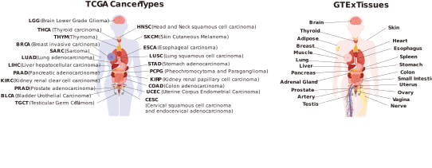

# Project Workflow


## 1. Training
### File Preparation Guide for Gene Expression Prediction Training
This document outlines the required data files and directory structure for running the gene expression prediction training script. Ensure the following files and directories are properly prepared before execution.

#### 1. Reference CSV File
Path:

**`/backup/lgx/path_omics_t/data/reference/dependency/{cancer_type}_ref.csv`**

(Replace {cancer_type} with your target cancer type, e.g., BLCA_ref.csv)

Format:

First Column: patient_id (unique patient identifier)
Subsequent Columns: Gene expression values (one column per gene)
Headers: Gene names
Example:
```
patient_id,GeneA,GeneB,...
patient_1,0.84,1.2,...
patient_2,0.91,0.75,...
...

```

#### 2. Feature Files
Directory:

/yourworkspace/data/result/cluster/{extraction_model}/{cancer_type}/

(Substitute {extraction_model} (e.g., vit, resnet) and {cancer_type})

Requirements:

Per-Patient Files: One file per patient (named {patient_id}.h5).
Contents: Each .h5 file must contain a feature array of shape [num_clusters, feature_dim].
num_clusters: Number of superpixel clusters (e.g., 900).
feature_dim: Dimensionality of extracted features (e.g., 1024 for ViT).
Consistency: All files must use identical feature_dim and storage format.

#### 3. Directory Structure
Organize directories as follows under /yourworkspace:

```
data/
├── reference/
│   └── dependency/               # Reference CSVs
│       ├── BLCA_ref.csv
│       └── ...
└── result/
    └── cluster/                  # Extracted features
        ├── vit/                  # e.g., ViT features
        │   └── BLCA/             # Cancer type
        │       ├── patient_1.h5
        │       └── ...
        └── resnet/               # e.g., ResNet features
            └── BLCA/
                └── ...
logs/                             # Auto-generated during runtime
script/                           # Source code modules (provided)

```
## 2. Evaluating
(Coming soon)
## 3. Predicting

All predicting processes are implemented in a single Python script svsToExpr.py:

```
from svsToExpr import process_svs_to_expression
result=process_svs_to_expression("./","test.svs","BRCA")
```
The order of output are defined in R/outputgenes.txt

---

## 4. Website Implementation

This repository contains the source code for:  
**https://www.hbpding.com/ImageDependency/**

### Deployment Recommendations
- **Server**: Apache2 on Debian
- **Environment**: Python3 required:
Linux:
```
sudo apt-get install openslide-tools
pip install -r requirements.txt
```
